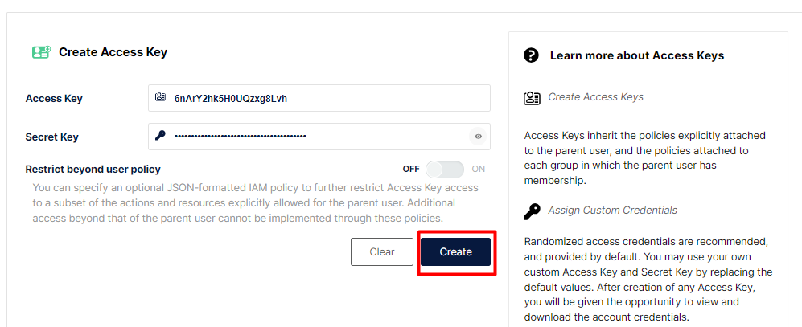

# Lab Eda - Kafka Connect


## Disclaimer
> **As configurações dos Laboratórios é puramente para fins de desenvolvimento local e estudos**


## Pré-requisitos?
* Docker
* Docker-Compose


## Kafka Connect


### Realizando download dos plugins dos conectores


Criando a imagem junto com o plugin do Debezium SQL Server


```

docker image build -t <<usuario>>/kafka-connet-debezium-lab:v213  -f Dockerfile .
 
```

Vamos enviar a imagem para o dockerhub ??
https://hub.docker.com/

```
docker image push <<usuario>>/kafka-connet-debezium-lab:v213
```

> As imagens customizadas encontra-se no https://hub.docker.com/


Imagem criada? ...mas antes

Altere o arquivo docker-compose.yaml da imagem criada no serviço `connect`


```

docker-compose up -d grafana prometheus zookeeper kafka-broker akhq connect sqlserver minio tempo loki otel-collector jaeger-all-in-one 

docker container ls
```

Listando os plugins existentes, os padrões da imagem e do debezium que foi inserido na imagem, via arquivo `Dockerfile`

```
docker exec -it kafkaConect curl  http://localhost:8083/connector-plugins
```

## Configurando o Conector Sql

### Configurando Banco de dados CDC para SQL

Será utilizado o connector debezium para sql server, ele faz a leitura do banco de dados via CDC.

> Para nossa exemplo iremos subir um banco de dados, caso já tenha um banco habilitado o CDC pode-se usar ele. Mais detalhes do que é Sql Server CDC, https://docs.microsoft.com/pt-br/sql/relational-databases/track-changes/about-change-data-capture-sql-server?view=sql-server-ver15

```
docker-compose up -d sqlserver
```

Para esse tutorial vamos utilizar a imagem sql server da Microsoft `mcr.microsoft.com/mssql/server:2019-latest`. Para criar a estrutura dos dados estou utilizando o próprio container criado.

>O arquivo para habilitar CDC e criar o banco de dados, as tabelas e popular com alguns dados está em sql/init.sql que foi executado via Microsoft SQL Server Management Studio ou você pode executar pelo próprio pod conforme código abaixo

Executando os scripts

```
export  SA_PASSWORD=Password!
cat sql/init.sql | docker exec -i sqlserver /opt/mssql-tools/bin/sqlcmd -U sa -P $SA_PASSWORD

```

### Provisionando Banco de dados Sql Server


### Criando os Conectores

*API rest do kafka Connect*
https://docs.confluent.io/platform/current/connect/references/restapi.html


Criando o conector Sql Server

```
 http PUT http://localhost:8083/connectors/connector-sql/config < conector-sql.json
```


* Observando o arquivo `conector-sql.json`

Algumas informações básicas sobre o connector:


* `spec.class`: Nome da classe do conector que está dentro do plugin debezium
* `spec.config.database.hostname` e `spec.config.database.port`: endereço IP ou nome de host para sua instância Sql Server, bem como a porta (por exemplo 1433)
* `spec.config.database.user` e `spec.config.database.password`: nome de usuário e senha para sua instância Sql Server
* `spec.config.database.dbname`: nome do banco de dados
* `spec.config.database.server.name`: Nome lógico que identifica e fornece um namespace para o servidor / cluster de banco de dados Sql Server específico que está sendo monitorado.
* `spec.config.table.whitelist`: lista separada por vírgulas de regex especificando quais tabelas você deseja monitorar para a captura de dados alterados


Listando os conectores

> https://docs.confluent.io/platform/current/connect/references/restapi.html

```
docker exec -it kafkaConect curl http://localhost:8083/connectors/
```

Verificando o status dos conectores

```
http http://localhost:8083/connectors/connector-sql/status

```

### Navegando pelo Akhq ?


Vamos tirar o comentario do conector no serviço akhq do arquivo docker-compose caso ainda o tenha.

```
docker-compose up -d akhq
```

* AKHQ http://localhost:8080/ui


### Testando o Conector

Vamos inserir alguns registros nas tabelas e listar os topicos do Kafka


```
export SA_PASSWORD=Password!

docker exec -i sqlserver /opt/mssql-tools/bin/sqlcmd -U sa -P $SA_PASSWORD -d dbEcommerce -Q "INSERT INTO produtos(nome,descricao)  VALUES ('Lapis','lapis de escrever');"

```

Listando os tópicos


```
docker exec -it kafka-broker /bin/bash
kafka-topics --bootstrap-server localhost:9092 --list 
```


*Consumindo mensagem sqldebezium.dbo.produtos - Datasource SQL Server*

```

kafka-console-consumer --bootstrap-server localhost:9092 --topic server.dbEcommerce.dbo.produtos --property print.headers=true  --property print.timestamp=true --property print.key=true --property print.value=true --property print.partition=true --from-beginning

```


#### Api Rest Kafka Connect


```
exit

docker exec -it kafkaConect curl http://localhost:8083/connectors/connector-sql/status

```

Interagindo com os connetores

```
http PUT http://localhost:8083/connectors/connector-sql/pause
http http://localhost:8083/connectors/connector-sql/status
http PUT http://localhost:8083/connectors/connector-sql/resume
```

### Jaeger


O suporte de rastreamento é baseado em dois projetos de código aberto:

* OpenTracing
* Jaeger

Ambos os projetos fazem parte da Cloud Native Computing Foundation, https://www.cncf.io/.

> OpenTracing é uma API independente para rastreamento distribuído que oferece suporte a diferentes protocolos e linguagens de programação. O próprio OpenTracing não implementa o rastreamento. Ele fornece apenas uma API interoperável para várias linguagens de programação. Outros projetos usam essas APIs para construir a implementação de rastreamento real sobre ela, como por exemplo o Jaeger.

O cliente Jaeger é executado como parte de seu aplicativo. Por exemplo, produtor ou consumidor do Kafka, ou um dos componentes Kafka, como Kafka Connect ou Mirror Maker 2.0.

O aplicativo usa a API OpenTracing para criar extensões de rastreamento e anexar IDs de rastreamento a solicitações de saída. O cliente Jaeger é responsável por propagar as informações sobre os spans para o agente Jaeger. 


O cliente geralmente não envia todos os rastreamentos ao agente, mas geralmente apenas uma pequena porcentagem, uma amostragem.

> http://localhost:16686/

## Instalando  Jaeger

```

docker-compose up -d jaeger-all-in-one 

docker container ls

```


# A imagem jaeger contem:

* `Agente` é o componente localizado no aplicativo para reunir os dados de rastreamento Jaeger localmente. Ele lida com a conexão e o controle de tráfego para o Coletor, bem como o enriquecimento dos dados.

* `O Jaeger Coletor`  é o componente responsável por receber os spans que foram capturados pelos Agente e gravá-los em um armazenamento.

* `Jaeger Consult`a é um serviço que recupera rastros do armazenamento e hospeda a interface do usuário para exibi-los.

---

## Estratégias de implantação

`All-in-One`: Esta é uma configuração fácil de implantar, boa para experimentar o produto, desenvolvimento e uso de demonstração. Você pode executá-lo como um binário predefinido ou uma imagem Docker. `Opção default`.

`Produção`: focado nas necessidades do ambiente de produção para alta disponibilidade e escalabilidade. Ele implanta cada serviço de back-end de forma independente e oferece suporte a várias réplicas e opções de dimensionamento. Ele também usa armazenamento de back-end persistente para manter os dados de rastreamento resilientes. Atualmente, ele oferece suporte às soluções de armazenamento `Elasticsearch`, `Cassandra` e `kafka`, com Elasticsearch como a solução recomendada para ambientes de produção.

`Streaming`: para ambientes de alta carga, esta configuração adiciona Kafka à estratégia de implantação de produção para tirar a pressão do armazenamento de back-end. Se você precisar executar a lógica de pós-processamento nos rastreamentos, será mais fácil executar antes de gravar no armazenamento.


*Mensagens com o rastreamento*

```

docker exec -it kafka-broker /bin/bash

kafka-topics --bootstrap-server localhost:9092 --list 

kafka-console-consumer --bootstrap-server localhost:9092 --topic server.dbEcommerce.dbo.produtos --property print.headers=true  --property print.timestamp=true --property print.key=true --property print.value=true --property print.partition=true --from-beginning

```


# AsyncApi

## Criando um arquiro AsyncAPI

https://studio.asyncapi.com/


### Microcks

Execute o docke-compose


```
docker-compose -f ambiente/docker-compose.yaml  up -d zk kafka-broker mongo keycloak postman app async-minion 

```

O que aconteceu ??

Acessando http://localhost:8080/

* Username: admin
* Password: microcks123


## Vamos subir o Arquivo AsyncAPI ?

No menu `Importers >> Upload` realizar o upload do arquivo `asyncAPI/microcks.yml`

Vamos observar....

Listando os tópicos kafka do mock

```
docker exec -it kafka-broker /bin/bash
kafka-topics --bootstrap-server localhost:9092 --list 
```

Consumindo as mensagens do tópico mock

```
kafka-console-consumer --bootstrap-server localhost:9092 --topic <<nome do tópico>>
```

> https://microcks.io/documentation/using/advanced/templates/


## KSqldb


```
docker-compose up -d  ksqldb-server ksqldb-cli 

//Entrando no container cli

docker-compose exec ksqldb-cli ksql http://ksqldb-server:8088
```


### Criando um tópico

Eu outro terminal crie um tópico
```
docker exec -it kafka-broker /bin/bash

kafka-topics --bootstrap-server localhost:9092 --create --partitions 1 --replication-factor 1 --topic alunos ;
```

No terminal do KSQL execute o comando abaixo:

```
ksql> show topics;

ksql> list topics;
```


Terminal Linux

```
kafka-console-producer --bootstrap-server localhost:9092 --topic alunos --property parse.key=true --property key.separator=:

//key:value

>aluno:aluno 1
>aluno:aluno 2
>aluno:aluno 3
>aluno:aluno 4
```
No terminal KSQLdb

```
print 'alunos' from beginning;

print 'alunos' from beginning limit 2;

print 'alunos' from beginning interval 2 limit 2 ;

print 'alunos' from beginning interval 2 ;

```
### Criando nosso primeiro stream

> No terminal do KSQLdb

```
create stream alunos_stream (id int, nome varchar , curso varchar) with (kafka_topic='alunos', value_format='DELIMITED');

```


Listando o Stream

```
list streams;
```


Descrever o Stream

```
describe ALUNOS_STREAM;

```

Selecionando os dados

```
select rowtime, id, nome, curso from ALUNOS_STREAM emit changes;
```

No outro terminal - linux

```

//Se não estiver dentro do container

docker exec -it kafka-broker /bin/bash

kafka-console-producer --bootstrap-server localhost:9092 --topic alunos --property parse.key=true --property key.separator=:

>aluno:1,aluno 1 ,arquitetura de dados
>aluno:2,aluno 2 ,engenharia de dados
>aluno:3,aluno 3 ,engenharia de dados
>aluno:4,aluno 4 ,arquitetura de dados
```

Cade os dados ??


```
 //Configuração para ver todas as mensagens produzidas
 SET 'auto.offset.reset'='earliest';
```

Agrupando as mensagens

```
^C
select curso, count(*) from ALUNOS_STREAM  group by curso emit changes;
```

### Criando seu stream no formato json

Terminal linux

```
kafka-topics --bootstrap-server localhost:9092 --create --topic professores --partitions 1 --replication-factor 1
```

Terminal KSqlDB

```
list topics;

create stream professores_stream (id int, nome varchar , materia varchar, quantidadeaula int) with (kafka_topic='professores', value_format='json');

show streams;

select rowtime, id, nome from professores_stream emit changes;

```


Terminal linux

```
kafka-console-producer --bootstrap-server localhost:9092 --topic professores --property parse.key=true --property key.separator=:

>professor1:{"id":1, "nome":"Fernando", "materia":"dados" , "quantidadeaula": 2}
>professor2:{"id":2, "nome":"Fabio", "materia":"dados", "quantidadeaula": 4}
>professor3:{"id":3, "nome":"Felipe", "materia":"dados", "quantidadeaula": 6}
```

### Visões Stream


Criando uma consulta baseada em um stream.

Terminal Ksqldb

```

SET 'auto.offset.reset'='earliest';


select  id, 'Professor: ' + ucase(nome) + ' de ' + materia 
+ ' , a quantidade de matéria é: '
+ case when quantidadeaula <= 2  then 'Bom'
       when quantidadeaula between 3 and 5 then 'Ótimo'
       else 'Excelente' 
   end as descricao
from professores_stream;

```

Executando o script criando a view.

```
run script '/scripts/view_professores_stream.ksql';

show streams;


```

No terminal do Linux crie mais uma mensagem


```
professor4:{"id":4, "nome":"Maria", "materia":"dados", "quantidadeaula": 8}
```

No terminal Ksqlsb


```
 describe view_professores_stream extended;

select descricao from view_professores_stream emit changes;
  
```

### Joins Ksqldb

> Stream podem fazer join com Stream
  Stream com Stream gera um novo stream
  Table com Table gera uma nova table
  Stream com Table gera um novo Stream


Terminal Linux
```
export SA_PASSWORD=Password!

docker exec -i sqlserver /opt/mssql-tools/bin/sqlcmd -U sa -P $SA_PASSWORD -d dbEcommerce -Q "INSERT INTO pedidos(dataPedido)  VALUES (getdate());"

docker exec -i sqlserver /opt/mssql-tools/bin/sqlcmd -U sa -P $SA_PASSWORD -d dbEcommerce -Q "INSERT INTO pedidosDetalhes(idPedido, idProduto )  VALUES (1,1);"


```


Terminal Ksql


```

CREATE stream produto_stream (id varchar , nome varchar, descricao varchar) WITH (KAFKA_TOPIC=' server.dbEcommerce.dbo.produtos',VALUE_FORMAT='json');

CREATE TABLE produto_table AS
    SELECT 
        id,
        latest_by_offset(nome) as nome,
        latest_by_offset(descricao) as descricao
    FROM 
        produto_stream
   GROUP BY id
   EMIT CHANGES;

show tables;

select * from produto_table emit changes;


CREATE STREAM pedidosdetalhes_stream (id integer, idPedido integer, idProduto varchar) WITH (kafka_topic='server.dbEcommerce.dbo.pedidosDetalhes', value_format='json');

CREATE STREAM pedidos_stream (id integer, dataPedido varchar) WITH (kafka_topic='server.dbEcommerce.dbo.pedidos', value_format='json');


create stream  pedidos_produto_stream as
select pedidos.id as idPedido, produtos.id as IdProduto, produtos.nome
from pedidos_stream pedidos 
left join pedidosdetalhes_stream pedidosdetalhes WITHIN 20 seconds  on pedidos.id = pedidosdetalhes.idPedido
left join produto_table produtos on pedidosdetalhes.idProduto= produtos.id emit changes; 

describe pedidos_produto_stream;


select * from pedidos_produto_stream emit changes;

```

Inserindo as informações das tabelas do Sql Server

```
USE dbEcommerce;

INSERT INTO produtos(nome,descricao)  VALUES ('Lapis','lapis de escrever');

declare @idProduto as int, @idPedido as int

select @idProduto= SCOPE_IDENTITY()

insert into pedidos values(getdate())

select @idPedido= SCOPE_IDENTITY()

insert into pedidosDetalhes values (@idPedido, @idProduto)

```


### Configurando MinIO


Acesso para o MinIO http://localhost:9001/login

* Senha : admin
* password: minioadmin


### Configurando o MinIO





Instalando o conector do MinIO

> Não esqueçam de mudar os campos  `aws.access.key.id` e `aws.secret.access.key` do arquivo `conector-minio.json`

```
http PUT http://localhost:8083/connectors/connector-minio/config < conector-minio.json

```

Listando os conectores

```
docker exec -it kafkaConect curl http://localhost:8083/connectors/
```

### Executando a aplicação Net para leitura das mensagens em Kafka

Observandos os novos tópicos

```
docker exec -it kafka-broker /bin/bash
kafka-topics --bootstrap-server localhost:9092 --list 

kafka-console-consumer --bootstrap-server localhost:9092 --topic produtos_change --property print.headers=true  --property print.timestamp=true --property print.key=true --property print.value=true --property print.partition=true --from-beginning


```

### Acessando o Grafana Loki

> http://localhost:3000/